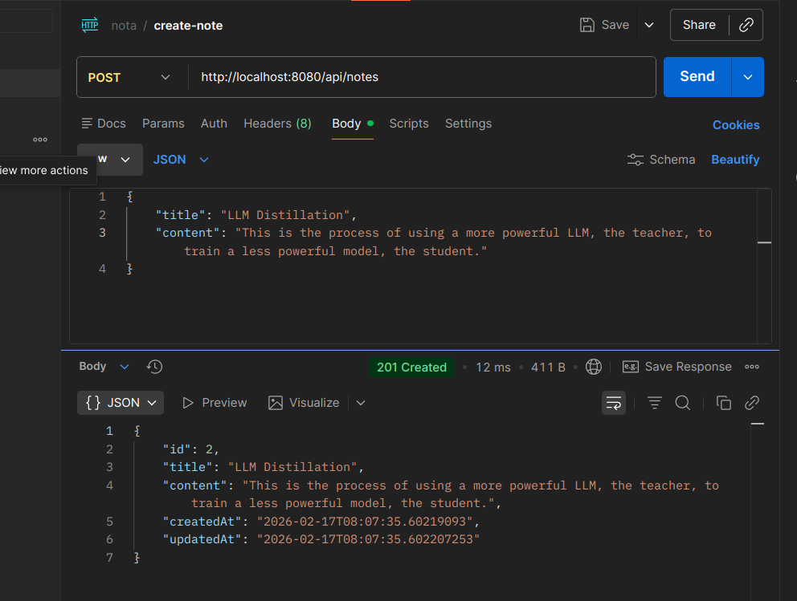
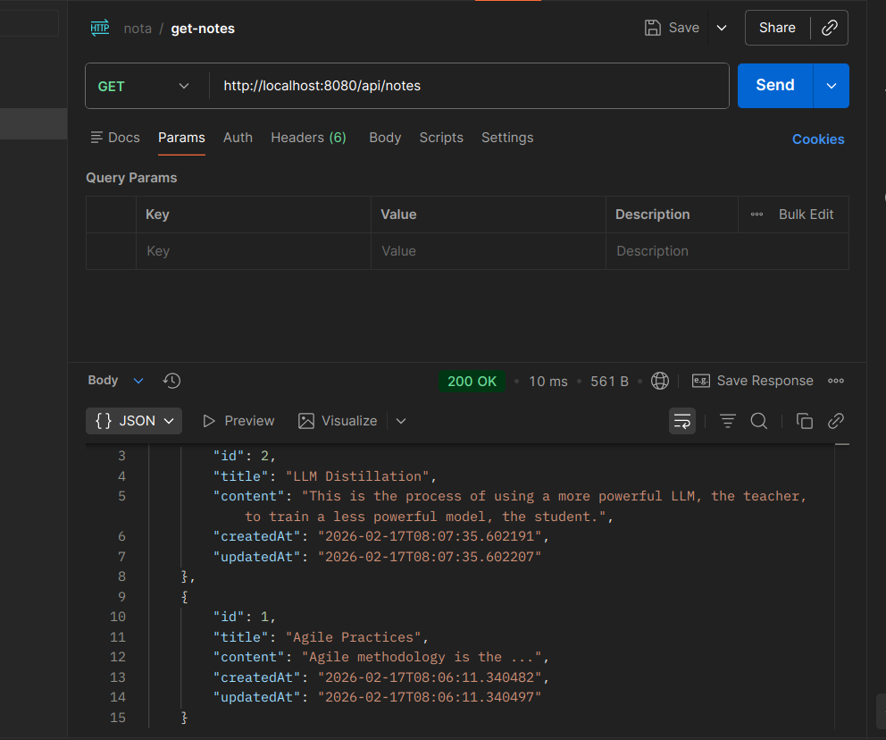
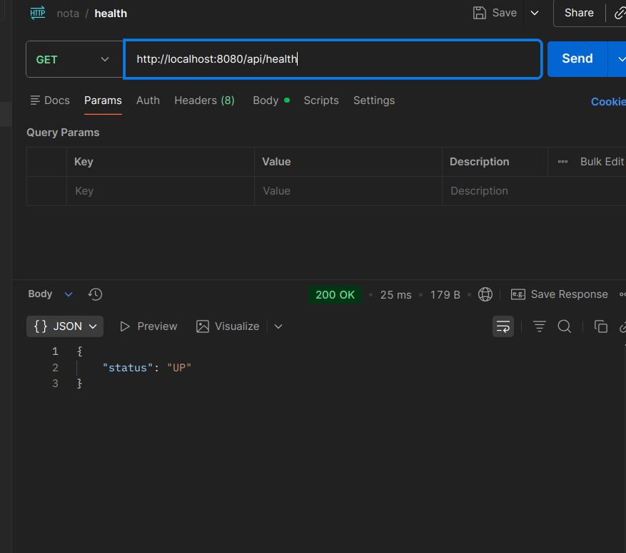
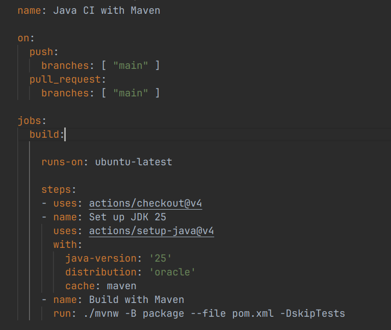
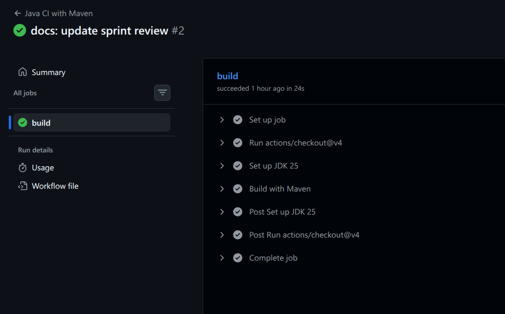
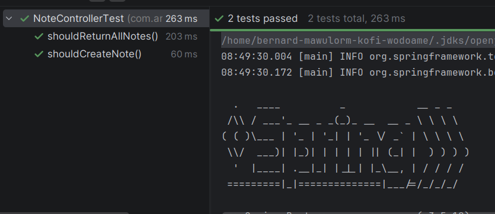

# Sprint 1 Review

## Goal
The primary objective of this sprint was to deliver the first increment of working software (Note creation and retrieval) and establish the initial DevOps pipeline.

## Delivered Items

### 1. Note Management API
Implemented core endpoints to allow users to create and retrieve notes.
*   **Create Note**: `POST /api/notes` - Saves a new note with title and content.

*   **Get All Notes**: `GET /api/notes` - Retrieves all saved notes, sorted by creation time.

### 2. Service Health Check
Implemented a health check endpoint to monitor application status.
*   **Health Check**: `GET /api/health` - Returns `{"status": "UP"}`.

### 3. CI/CD Pipeline
Established a basic Continuous Integration pipeline using GitHub Actions.
*   **Workflow**: `.github/workflows/ci.yml` is set up to build the project and run tests on every push.

### 4. Testing Implementation
Integrated unit tests for the `NoteController` to ensure the reliability of the API endpoints.
*   **Unit Tests**: `NoteControllerTest.java` verifies the listing and creation of notes.

