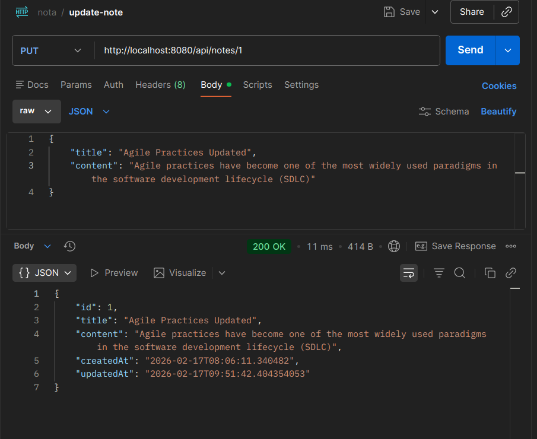
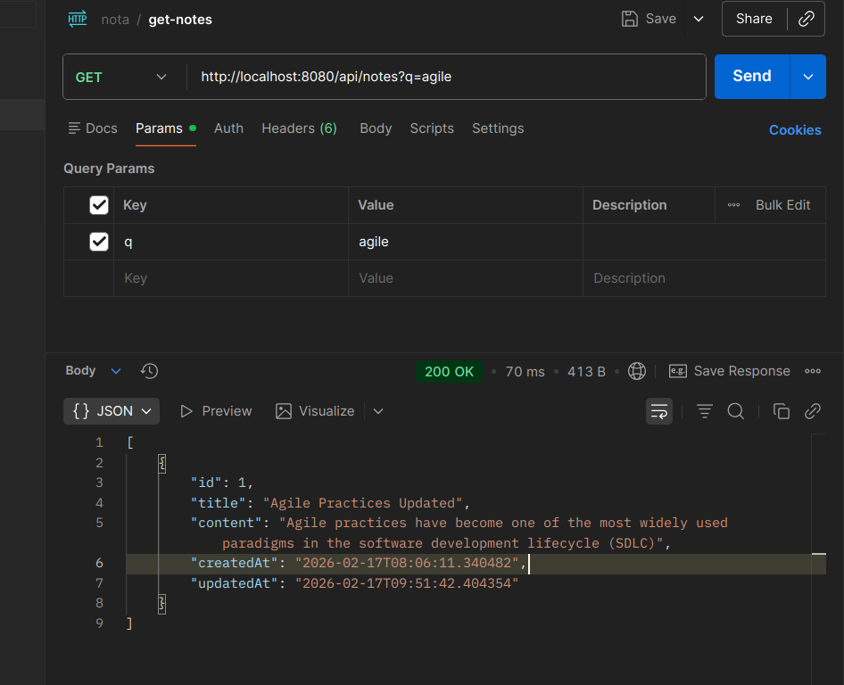
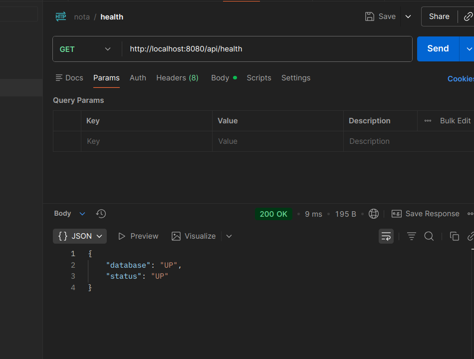
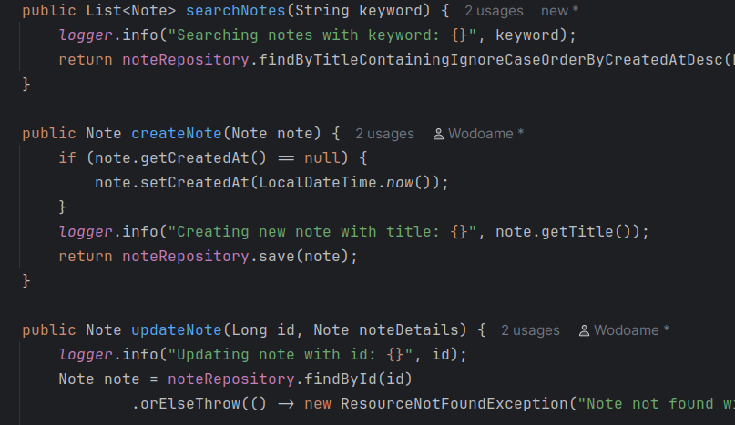
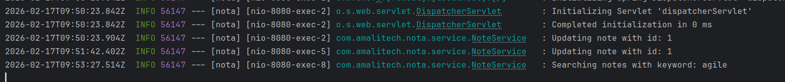

# Sprint 2 Review

## Goal
The objective of this sprint was to apply feedback from Sprint 1 (H2 database for tests, Global Exception Handling), deliver the next functional increment (Update Note, Search Notes), and establish basic application monitoring.

## Delivered Items

### 1. Process Improvements (Sprint 1 Feedback)
*   **H2 Database for Testing**: Configured `H2` in-memory database for the `test` profile. This resolved CI/CD and local testing issues by removing the dependency on a local PostgreSQL instance for tests.
*   **Global Exception Handling**: Implemented `@ControllerAdvice` to handle exceptions globally. Added `ResourceNotFoundException` and standardized error responses for validation and system errors.

### 2. New Features
#### Update Note
Implemented `PUT /api/notes/{id}` to allow users to modify existing notes.
*   **Endpoint**: `PUT /api/notes/{id}`
*   **Body**: `{"title": "Updated Title", "content": "Updated Content"}`
*   **Response**: 200 OK with the updated note.

#### Search Notes
Implemented search functionality to find notes by title.
*   **Endpoint**: `GET /api/notes?q={keyword}`
*   **Response**: List of notes matching the keyword (case-insensitive).

### 3. Monitoring & Logging
#### Health Check Enhancement
Enhanced the health endpoint to verify database connectivity.
*   **Endpoint**: `GET /api/health`
*   **Response**: `{"status": "UP", "database": "UP"}` (includes DB connection status).

#### Application Logging
Integrated `SLF4J` logging to track key application events and errors.
*   **Events Logged**: Note creation, Note updates, Note searches.
*   **Errors Logged**: Validation failures, Resource not found events, and unexpected exceptions.

### 4. Testing
Updated unit and integration tests to cover new features and verify the new architecture (Service layer).
*   **Tests Passed**: All tests in `NoteControllerTest` passed successfully.

### 5. CI/CD Success
The CI pipeline successfully built the project and executed all tests using the new H2 database configuration.
*   **Build Status**: Success
*   **Test Results**: All tests passed in the CI environment.

## Metrics
*   **Velocity**: Successfully delivered all planned backlog items (Update Note, Search Notes, Monitoring).
*   **Quality**: 100% pass rate on automated tests with H2 configuration.
